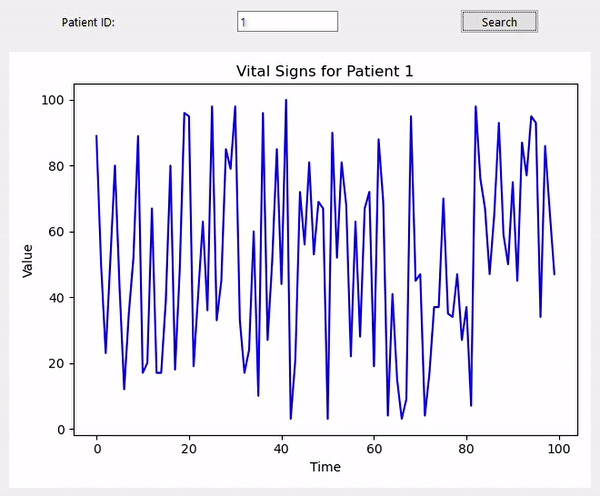

# Real-time Medical Data Monitoring System

## Introduction
This system is designed to simulate the communication between a medical device (client) and a server application, storing and visualizing vital sign data in real-time. The system comprises three main components: 
1. **Client (Medical Device Simulator)**: Simulates a medical device generating vital sign data and sending it to the server.
2. **Server**: Listens for incoming connections from client devices, stores the received data in a Redis database.
3. **GUI (Data Visualization)**: Provides a user-friendly interface to visualize and search for patient vital sign data stored in Redis.

## Components
### 1. Client (Medical Device Simulator)
- `client.py`: Simulates a medical device that continuously generates random vital sign data and sends it to the server through a TCP socket connection.

### 2. Server
- `server.py`: Listens for incoming connections from client devices, receives and stores vital sign data in a Redis database.

### 3. GUI (Data Visualization)
- `gui.py`: Provides a user-friendly GUI to search for patient vital sign data stored in Redis, and visualize it using matplotlib.
## Flow Diagram

## Setup
1. Install Python (if not already installed) from [python.org](https://www.python.org/downloads/).
2. Install required Python libraries using pip:
3. Install and run Redis. You can download Redis from [redis.io](https://redis.io/download) and follow the installation instructions.
4. Run the server:
5. Run the GUI application:
6. Run the client simulator in a separate terminal or environment:

## Usage
- The GUI allows users to search for patient vital sign data by entering the patient ID.
- Upon successful search, the vital sign data is retrieved from Redis and displayed visually in a chart.
- The client simulator continuously generates and sends random vital sign data to the server, which is then stored in Redis.

## Notes
- Ensure Redis is running before starting the server and GUI application.
- Adjust the host and port configurations in the code files if necessary.

